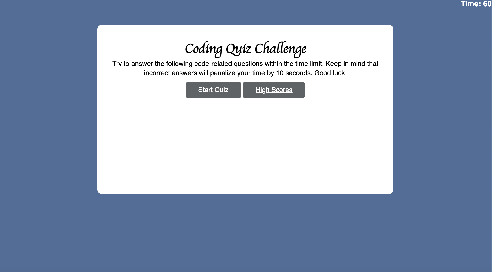

# Coding Quiz

## Instructions
Build a timed coding quiz on HTML and JavaScript fundamentals, with multiple-choice questions. This app will run in the browser, and have a clean, polished, and responsive user interface. The languages used will be ***HTML*** and ***CSS*** powered by ***JavaScript*** 

## How to Use Application
1. When user loads quiz, they will begin test by clicking the start button. 
2. When the start button is clicked, timer will begin at 60 seconds.
3. If user answers a question incorrectly, 10 seconds will be deducted from the time.
4. When all questions are answered, game is over and user will see their score
5.  User will be able to insert their first and last name to store their high score. 

## Screenshot of Project

### Links to Project
1. https://github.com/itz-essie/Coding-Quiz
2. https://itz-essie.github.io/Coding-Quiz/
